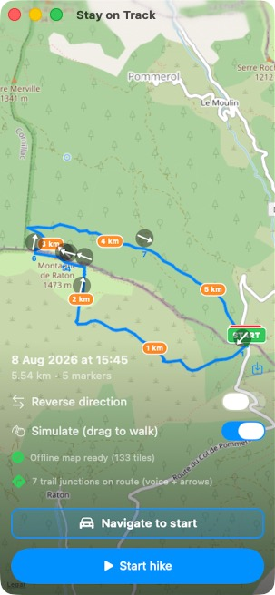

# Stay on Track

**A minimal, fully-offline hiking companion that keeps you on your intended trail.**

You load a planned hike as a GPX file, and Stay on Track guides you along it — warning you *out loud* at every point where another path joins yours, so you never take the wrong fork. It works entirely offline on the trail (put your phone in airplane mode for all-day battery), and it keeps your phone in your pocket: the important cues are **audio**.

<p align="center">
  
</p>

---

## Why this exists

Most hiking apps show you a map and leave you to stare at it. On a real trail the moment you get lost is a **decision point** — a junction where another path branches off and you confidently walk down the wrong one. Stay on Track focuses on exactly that moment:

- It knows where the real trail junctions are (from OpenStreetMap), matched onto your route — on footpaths **and** on streets when the route passes through a town.
- As you reach one, a **posh British voice** simply says **"Left"**, **"Right"**, or **"Straight"** — how to stay on your intended path.
- If you drift off the trail it **speaks the distance** — "twenty / fifty / one hundred metres off trail" — and says **"back on trail"** once you're back, so you can course-correct without looking.

Everything needed for the hike is downloaded once (map, trails, elevation) when you import the route. After that it's fully offline.

## Features

**Following your route**
- **Import a GPX** via the share sheet, Files, or "open in".
- **Offline OpenStreetMap tiles** — a corridor around your route is downloaded and disk-cached at import, so the map works in airplane mode. The cache **survives app restarts** and re-hiking the same area needs no re-download.
- **1 km distance markers** and a **green START / red STOP** sign at the route ends (30% transparent, so an out-and-back loop shows both).
- **Reverse** toggle to walk the route the other way (markers, junctions and turns all flip).
- **Faint breadcrumb** of where you've actually walked.

**Junction guidance (the core feature)**
- **Decision-point detection** from the OSM network (via Overpass): nodes where **three or more segments meet**, matched to within 40 m of your route (GPS-error tolerant). Covers **trails and streets**, so you still get turn cues when the route follows a road or crosses a town.
- **Voice cue** — "Left / Right / Straight" spoken as you reach each junction, using a **high-quality offline voice** ([Kokoro](https://github.com/hexgrad/kokoro), British female "Emma"), pre-rendered and bundled. Take a wrong fork and it says **"wrong turn"**; pause at a junction and it **repeats** the instruction.
- **On-map arrows** — a discreet arrow at each junction pointing the actual compass direction to continue.
- **Top HUD** showing the next junction's maneuver and a live distance countdown.
- Junctions are **cached per route**, so re-opening the same hike needs no network.

**Off-trail alert**
- Silent while you're on route; stray past 20 / 50 / 100 m and it **speaks the distance** — "twenty metres off trail" — then says **"back on trail"** once you're within 5 m again. (Spoken in the same bundled offline voice.)

**Before you start**
- The first screen shows the hike's **distance, total elevation gain, and estimated time** (grade-adjusted) at a glance.
- **Alternative routes** — one tap finds a **shorter** or **longer** walkable path between your start and finish over the OSM footpath/street graph.
- **Navigate to start** — hand the trailhead coordinate to Apple Maps, Google Maps, Waze, or the share sheet (Tesla, etc.) to drive there.

**Elevation & weather profile**
- A live **elevation chart** along the bottom: linear distance before you start, then a distance-ahead view once hiking, with heights labelled **relative to where you're standing** and prominent **peaks** marked.
- The **forecast temperature** is drawn over the chart and labelled **for every hour** of the walk (from [Open-Meteo](https://open-meteo.com/), fetched at import), so you can see how warm it'll be when you get there.

**Trailside food**
- **Restaurants and cafés within 200 m** of the route are shown as map pins and in a list, each with the **time into the hike** you'll reach it.

**Live stats & ETA**
- Elapsed time, **time left**, **distance walked** and **elevation gained** (from your actual track), and current off-trail distance.
- Two ETAs: a grade-adjusted **Calculated ETA** (Tobler's hiking function over the route's elevation profile) and a **Your-pace ETA** (from your measured pace, after 10 minutes), plus a **pace-vs-calculated %**.
- If the GPX has no elevation, it's fetched from a DEM ([Open-Meteo](https://open-meteo.com/)) at import.

**On the move**
- Your position stays **centred** on screen during a real walk (your zoom is never changed); a **Recenter** button appears if you pan away.
- **Two-finger rotate** the map, **tap the compass** to snap back to north; a small **compass needle** on your position shows the way you're facing.
- The route line **thickens on steep ground** (up to 4× at a 25% grade) and everything more than **1 km ahead fades back**, so the next kilometre stands out.
- **Auto-stop** — the hike ends itself when you reach the finish (after at least 20 minutes), or if you speed up to car pace and forget to stop.
- **Live status** — an iPhone **Live Activity** (Lock Screen + Dynamic Island) showing the next junction and distance. (On the Mac Catalyst dev build this is shown as notifications for testing.)

**Never lose your place**
- If the app is killed mid-hike (crash, low memory), relaunching offers to **resume the hike** exactly where it left off — track, timer, ETA and all.

**Recording**
- Records your actual track and **exports it as GPX** to share to another app when you stop.

**Testing**
- A **drag-to-walk simulation**: drag the position marker and the whole app behaves as if you're walking there — directions, off-trail cues, stats, recording — so it can be developed and demoed without leaving your desk.

## Install (sideload)

[-via_SideStep-0a84ff?style=for-the-badge&logo=apple)](https://github.com/johnbuckman/stayontrack/releases/latest/download/stayontrack-installer.zip)

Stay on Track isn't on the App Store. The one-tap installer above (run it on a Mac) downloads [**SideStep**](https://github.com/johnbuckman/SideStep) and installs Stay on Track onto your iPhone/iPad, signed with your own Apple ID. Or grab the raw **[release IPA](https://github.com/johnbuckman/stayontrack/releases/latest)** and sideload it yourself — it's also listed in SideStep's built-in app catalog. Requires iOS 17.

## How it works

- **SwiftUI** app; **MapKit** with a custom `MKTileOverlay` serving cached OSM raster tiles; **CoreLocation** for tracking and heading; **AVFoundation** for the bundled voice clips.
- Junctions come from the **Overpass API**; the app builds the walkable graph (footpaths + streets) and keeps nodes of degree ≥ 3 near the route. Turn direction is computed from the route's own geometry; off-trail distance uses a windowed nearest-point search so loops and switchbacks don't confuse it.
- **Alternative routes** run an A* search over that same OSM graph; **restaurants** are an Overpass POI query; **weather** is an hourly forecast from Open-Meteo — all fetched at import and cached per route so the hike stays offline.
- Built for **iPhone**, with a **Mac Catalyst** build used for development (the window is pinned to iPhone size).

## Building

Requires Xcode and [XcodeGen](https://github.com/yonsm/XcodeGen):

```bash
brew install xcodegen
git clone https://github.com/johnbuckman/stayontrack.git
cd stayontrack
xcodegen generate
open StayOnTrack.xcodeproj
```

Or build the Mac Catalyst app from the command line:

```bash
xcodegen generate
xcodebuild -project StayOnTrack.xcodeproj -scheme StayOnTrack \
  -destination 'platform=macOS,variant=Mac Catalyst' build
```

The Xcode project is generated from `project.yml` and is not checked in.

## Data sources & attribution

- **Map tiles & trail data:** © [OpenStreetMap](https://www.openstreetmap.org/copyright) contributors. Trail junctions are queried via the [Overpass API](https://overpass-api.de/). ⚠️ The default tile source is OSM's own servers, which is fine for personal use but **not** for a widely-distributed app — see the [OSM tile usage policy](https://operations.osmfoundation.org/policies/tiles/) and point the app at your own tile server or a provider before shipping to many users.
- **Elevation & weather:** [Open-Meteo](https://open-meteo.com/) — the elevation API (Copernicus DEM) fills in a GPX with no elevation, and the forecast API supplies the hourly temperature profile.
- **Voice:** [Kokoro-82M](https://github.com/hexgrad/kokoro) (Apache-2.0) — the spoken cues ("Left/Right/Straight", the off-trail distances, "back on trail", "wrong turn") are pre-rendered and bundled so the app stays offline.
- **Pace model:** Tobler's hiking function.

## Status

Actively developed and released for iPhone (sideloaded). Current features: import, offline tiles, junction detection + voice + arrows (trails and streets), spoken off-trail / back-on-trail / wrong-turn cues, pre-hike distance / ascent / time, alternative shorter-or-longer routes, the elevation + hourly-temperature profile, trailside restaurants with arrival times, live stats + time-left + dual ETA, map rotation / compass / grade-styled route, auto-stop, crash-resume, recording/export, navigate-to-start, and the drag-to-walk simulation. Includes an iPhone Live Activity (Lock Screen + Dynamic Island).

## License

[GNU General Public License v3.0](LICENSE) © John Buckman.
